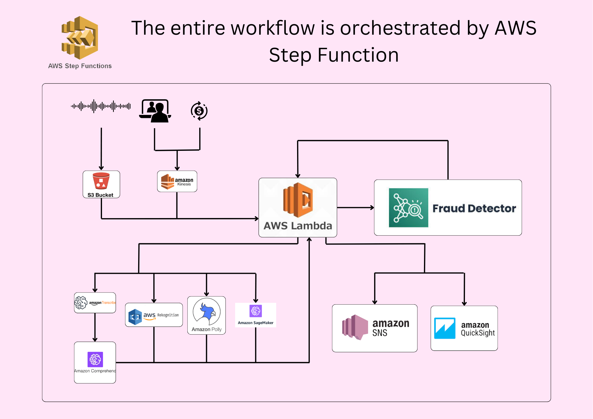

# Detecting Spam Calls, Deepfake Fraud, and VKYC Exploitation Using AWS Services

## Overview
This project aims to build a comprehensive system using AWS services to detect and mitigate spam calls, deepfake fraud, and VKYC (Video Know Your Customer) exploitation in the financial services industry. The system leverages various AWS tools for real-time data ingestion, preprocessing, detection, and reporting.

## Table of Contents
- [Project Objectives](#project-objectives)
- [Services Used](#services-used)
- [System Architecture](#system-architecture)
- [Setup and Installation](#setup-and-installation)
- [Code Structure](#code-structure)
- [How to Use](#how-to-use)
- [Contributions](#contributions)
- [License](#license)

## Project Objectives
- **Spam Call Detection**: Identify and block spam calls using AWS tools like Amazon Transcribe and Amazon Comprehend.
- **Deepfake Detection**: Detect manipulated videos and prevent fraud in VKYC sessions using Amazon Rekognition and AWS Polly.
- **Anomaly Detection**: Detect fraudulent transactions using machine learning models deployed via Amazon SageMaker.
- **Real-Time Detection**: Implement real-time detection and response mechanisms to mitigate fraud and improve customer trust.
- **Dashboard and Alerts**: Provide interactive dashboards and real-time alerts to keep stakeholders informed of suspicious activities.

## Services Used
- **AWS Lambda**: Real-time data ingestion and preprocessing.
- **Amazon Transcribe**: Converts audio files to text for analysis.
- **Amazon Comprehend**: Analyzes text to identify scam phrases.
- **Amazon Rekognition**: Detects deepfake facial manipulations in videos.
- **AWS Polly**: Analyzes voice features to detect AI-synthesized speech.
- **Amazon SageMaker**: Machine learning for anomaly detection in transactions.
- **Amazon Fraud Detector**: Calculates fraud risk scores.
- **Amazon SNS**: Sends real-time alerts.
- **Amazon QuickSight**: Generates dashboards for fraud and spam statistics.
- **AWS Step Functions**: Orchestrates the workflow between different AWS services.

## System Architecture


## Setup and Installation
1. Clone this repository to your local machine:
    ```bash
    git clone https://github.com/suriyasureshok/i-Hack-AWS-Financial-Security-Hackathon.git
    cd i-Hack-AWS-Financial-Security-Hackathon
    ```

2. Install the required dependencies:
    ```bash
    pip install -r requirements.txt
    ```

3. Ensure you have AWS CLI configured with appropriate credentials:
    ```bash
    aws configure
    ```

4. Set up the necessary AWS resources:
    - Create an S3 bucket for storing audio, video, and transaction data.
    - Set up IAM roles and policies for Lambda, Rekognition, SageMaker, etc.
    - Deploy AWS CloudFormation templates for infrastructure setup.

## Code Structure

```plaintext
project-name/
├── README.md
├── architecture-diagrams/
│   └── high-level-architecture.png
├── datasets/
│   ├── spam-call-audio/
│   ├── deepfake-video/
│   └── transaction-data.csv
├── preprocessing/
│   ├── audio_preprocessing.py
│   ├── video_preprocessing.py
│   └── transaction_cleaning.py
├── models/
│   ├── spam_detection/
│   │   ├── train_spam_model.py
│   │   └── spam_model_deploy.py
│   ├── deepfake_detection/
│   │   ├── train_deepfake_model.py
│   │   └── deepfake_model_deploy.py
│   └── anomaly_detection/
│       ├── train_anomaly_model.py
│       └── anomaly_model_deploy.py
├── services/
│   ├── lambda_functions/
│   │   ├── preprocess_lambda.py
│   │   └── decision_maker_lambda.py
│   ├── sagemaker_notebooks/
│   │   └── anomaly_detection.ipynb
│   └── rekognition_scripts/
│       └── detect_deepfake.py
├── dashboards/
│   └── quicksight_reports.md
└── deployment/
    ├── cloudformation_template.yaml
    └── step_functions_workflow.json
